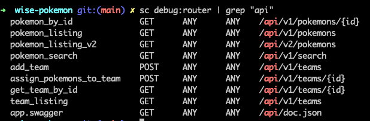
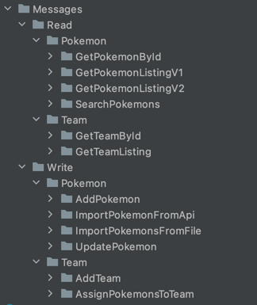
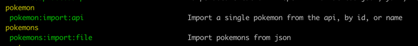

## WisePokemon

Setup, see symfony server:
https://symfony.com/doc/current/setup/symfony_server.html

### Todo
* add unique checks (create team)
* create open api spec

### API routes



### Security

Protected route:
```
^/api/v1/teams/*
```

see:
* config/security.yaml
* src/WisePokemon/Infrastructure/Security/ApiKeyAuthenticator.php

### Messages
Symfony messenger is used for all read & write operations



### Commands
* load pokemons from json file
* load single pokemon from api (id or name)



### Code quality

#### Static analysis & auto fix
See Makefile:
* php-cs-fixer
* psalm

```
make code_check
```

#### Run tests

```
make run_tests_stop_on_error_failure
```
