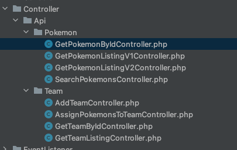

## WisePokemon

Setup, see symfony server:
https://symfony.com/doc/current/setup/symfony_server.html

```
symfony proxy:domain:attach wise-pokemon
```

### Todo / remarks
* map all pokemon properties (currently only id, name, types, ...)
* advanced types search
* importId added to pokemon, id = string

### Demo env

`https://wise-pokemon.herokuapp.com`

E.g.
https://wise-pokemon.herokuapp.com/api/v1/pokemons?sort=name-asc

### API routes

see folder `src/WisePokemon/Infrastructure/Controller/Api/`




### Security

Protected route:

```
^/api/v1/teams/*
```

e.g.
```
curl --location --request GET 'https://wise-pokemon.test/api/v1/teams' \
--header 'Authorization: Bearer token'
```

see:
* config/security.yaml
* src/WisePokemon/Infrastructure/Security/ApiKeyAuthenticator.php

### Messages
Symfony messenger is used for all read & write operations.

* middleware can easily be added (validation, xss, audting, ...)
* async sync switching
* clear overiew of all application operations
* all operations can be developed/tested in a uniform way


### Commands
* load pokemons from json file 
  * ``symfony console pokemons:import:file``
* load single pokemon from api (id or name) 
  * ``symfony console pokemon:import:api pikachu``


### Code quality

#### Static analysis & auto fix
See Makefile:
* php-cs-fixer
* psalm

```
make code_check
```

#### Run tests

```
make run_tests_stop_on_error_failure
```
